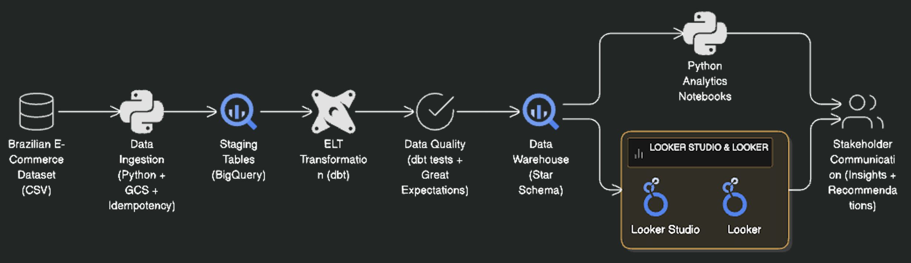

# Project Insight: Brazil E-Commerce

## Overview

This project builds a complete date pipeline and analytics ecosystem using the Braazilian E-Commerce dataset. It demonstrates best practices in data ingestion, transformation, quality assurance, warehousing and business intelligence powered by modern tools such as **Python**, **BigQuery**, **dbt**, **Great Expectations**, **Looker** and **Looker Studio**.

Ther result is a scalable, transparent and well governed data platform that enables analysts, data scientists and business stakeholders to extract reliable insights about customer behaviour, sales performance, logistics efficiency and marketplace operations.

## 1. Architecture Overview

### System Diagram



---

### Architecture Summary

1. The pipeline follows a modern **ELT (Extract, Load, Transform)** pattern deployed on Google Cloud:

2. **Data Ingestion (Python → Google Cloud Storage)**
   Raw CSV files are ingested with an idempotent Python process, ensuring clean, repeatable loads.

3. **Staging Layer (BigQuery)**
   Staging tables provide a stable structure for raw data and serve as the foundation for transformations.

4. **Transformation Layer (dbt)**
   dbt applies modular SQL transformations, implements business logic, and manages documentation and lineage.

5. **Data Quality (dbt Tests + Great Expectations)**
   Automated validations ensure accuracy, completeness, freshness, and rule compliance.

6. **Data Warehouse (Star Schema in BigQuery)**
   Fact and dimension tables are modeled for fast analytics and reliable reporting.

7. **Analytics & Visualization**

- **Looker & Looker Studio** dashboards for KPIs and business insights
- **Python notebooks** for deeper analysis and data science exploration

8. **Stakeholder Communication**
   Insights, dashboards, and recommendations are delivered to leadership for data-driven decision making.

---

### Technology Stack

| Layer               | Technology                                         | Rationale                                                             |
| ------------------- | -------------------------------------------------- | --------------------------------------------------------------------- |
| **Data Ingestion**  | Python (pandas, sqlalchemy) + Google Cloud Storage | Serverless, cost-effective, idempotent loading                        |
| **Data Warehouse**  | Google BigQuery                                    | Native dbt integration, partitioned/clustered, auto-scaling           |
| **ELT Framework**   | dbt v1.3+ with dbt Cloud                           | Modular SQL, automated testing, documentation generation              |
| **Data Quality**    | dbt tests + Great Expectations                     | Comprehensive validation layers, automated checks                     |
| **Analytics**       | Python (pandas, sqlalchemy, seaborn) in JupyterLab | Reproducible, shareable analysis notebooks                            |
| **Orchestration**   | dbt Cloud (primary) or Google Cloud Composer       | Managed, scheduled, integrated pipeline runs                          |
| **Dashboards**      | Looker Studio (free) + Looker (optional)           | Real-time BigQuery connection, role-based access, zero infrastructure |
| **Access Control**  | Google Cloud IAM + BigQuery permissions            | Row/column-level security, audit logging                              |
| **Version Control** | GitHub                                             | Single source of truth, CI/CD integration                             |

## 2. Data Ingestion

### Strategy

Cloud-native batch ingestion with idempotency, error handling, and metadata tracking. Separate staging tables preserve raw data for audit trails.

### Implementation

_Work in progress.._

---

## 3. Data Warehouse Design

### Star Schema Architecture

**Fact Table: `fact_orders`**

```sql


```

**Dimension Tables:**

`dim_customer`:

```sql


```

`dim_product`:

```sql


```

`dim_date`:

```sql


```

**Design Justification:**

_Work in progress...._

---

## 4. ELT Pipeline with dbt

### Project Structure

```


```

### dbt Models

**Staging Model Example:**

```sql


```

**Dimension Model (SCD Type 1):**

```sql


```

**Fact Model (Incremental):**

```sql


```

### dbt YAML Testing

```yaml

```

### dbt Commands

```bash


```

---

## 5. Data Quality Testing

### Testing Strategy: Multi-Layer Approach

**Layer 1: dbt Native Tests**

```yaml
- unique
- not_null
- relationships
- dbt_utils.expression_is_true
```

**Layer 2: Great Expectations**

```python

```

**Layer 3: Custom SQL Checks**

```sql


```

---

## 6. Python Analytics

### Notebook 1: Exploratory Data Analysis

```python

```

### Notebook 2: Key Business Metrics

```python

```

---

### Notebook 3: Business Insights & Recommendations

```python

```

---

## 7. Pipeline Orchestration

### Option 1: dbt Cloud

**Setup:**

1. Connect GitHub repository to dbt Cloud
2. Configure production job with schedule
3. Enable webhook notifications

**Production Job Configuration:**

```yaml

```

### Option 2: Google Cloud Composer (Airflow)

```python

```

---

## 8. Dashboards & Visualization

### Looker Studio Setup

**Four Dashboard Types:**

1. **Executive Dashboard**

   - Total revenue, orders, customers (metric cards)
   - Monthly revenue trend (line chart)
   - Top product categories (bar chart)
   - Revenue by state (map)
   - Filters: Date range, category, state

2. **Sales Operations Dashboard**

   - Daily order volume
   - Payment method distribution
   - Fulfillment metrics
   - Orders by seller
   - Real-time alerts

3. **Customer Analytics Dashboard**

   - RFM segmentation
   - Customer lifetime value distribution
   - Repeat purchase rate
   - Customer acquisition trends
   - Churn analysis

4. **Data Quality Dashboard**
   - Last ingestion timestamp
   - Row counts by table
   - Quality rule violations
   - dbt test results
   - Pipeline health metrics

### Looker Studio Connection

```
Data Source: BigQuery
Project: project-samba-insight
Dataset: project-samba-insight
Table: facts.fact_orders
Refresh: Every 30 minutes
```

---
