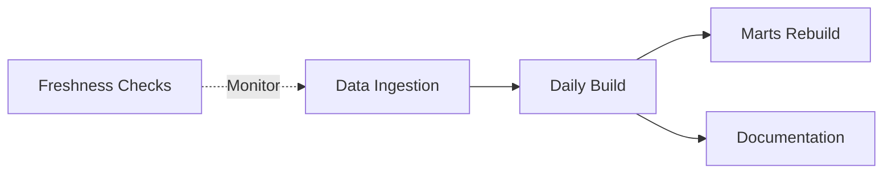

# dbt Cloud Deployment Guide

Complete guide for deploying Samba Insight to dbt Cloud with automated orchestration.

---

## Table of Contents

1. [Prerequisites](#prerequisites)
2. [Initial Setup](#initial-setup)
3. [Project Configuration](#project-configuration)
4. [Environment Setup](#environment-setup)
5. [Job Configuration](#job-configuration)
6. [Monitoring & Alerts](#monitoring--alerts)
7. [Best Practices](#best-practices)
8. [Troubleshooting](#troubleshooting)

---

## Prerequisites

### Required Accounts
- **dbt Cloud Account** (Team or Enterprise plan recommended)
- **GitHub Account** with repository access
- **Google Cloud Project** with BigQuery enabled
- **Service Account** with BigQuery permissions

### Required Permissions

**BigQuery Service Account needs:**
- `BigQuery Data Editor` - Create/modify tables
- `BigQuery Job User` - Run queries
- `BigQuery User` - Access datasets

**GitHub Repository needs:**
- Read access for dbt Cloud
- Write access for CI/CD (optional)

---

## Initial Setup

### Step 1: Create dbt Cloud Project

1. **Log in to dbt Cloud**
   - Navigate to https://cloud.getdbt.com/
   - Click "New Project"

2. **Connect to GitHub**
   - Select "GitHub" as connection method
   - Authorize dbt Cloud to access your repository
   - Select the `project-samba-insight` repository
   - Choose `main` or `dev` as the default branch

3. **Name Your Project**
   - Project Name: `Samba Insight - Brazilian E-Commerce Analytics`
   - Subdirectory: `dbt/` (important!)

### Step 2: Configure BigQuery Connection

1. **Create Connection**
   - Connection Type: `BigQuery`
   - Connection Name: `BigQuery Production`

2. **Authentication Method: Service Account JSON**

   Upload your service account JSON file or paste the contents:

   ```json
   {
     "type": "service_account",
     "project_id": "project-samba-insight",
     "private_key_id": "...",
     "private_key": "...",
     "client_email": "bigquery-admin@project-samba-insight.iam.gserviceaccount.com",
     "client_id": "...",
     "auth_uri": "https://accounts.google.com/o/oauth2/auth",
     "token_uri": "https://oauth2.googleapis.com/token",
     "auth_provider_x509_cert_url": "https://www.googleapis.com/oauth2/v1/certs",
     "client_x509_cert_url": "..."
   }
   ```

3. **Connection Settings**
   - **Project ID:** `project-samba-insight`
   - **Location:** `US` (or your BigQuery dataset location)
   - **Timeout:** `300` seconds
   - **Maximum Bytes Billed:** `1000000000` (1 GB - optional cost control)

4. **Test Connection**
   - Click "Test Connection"
   - Verify success message

---

## Project Configuration

### Step 3: Configure Development Environment

1. **Create Development Credentials**
   - Go to "Your Profile" → "Credentials"
   - Select your project
   - Configure development schema:
     ```
     Dataset: dev_[your_name]_warehouse
     Target: dev
     Threads: 4
     ```

2. **Initialize dbt**
   - Click "Initialize dbt project"
   - dbt Cloud will create necessary folders
   - Verify `dbt_project.yml` is detected

### Step 4: Set Up Environment Variables

1. **Navigate to Project Settings** → **Environment Variables**

2. **Add Variables:**

   | Variable Name | Value | Description |
   |---------------|-------|-------------|
   | `DBT_DATASET_STAGING` | `staging` | Staging dataset name |
   | `DBT_DATASET_WAREHOUSE` | `warehouse` | Warehouse dataset name |
   | `DBT_PROFILE_TARGET` | `prod` | Target environment |

3. **Save Environment Variables**

---

## Environment Setup

### Step 5: Create Deployment Environment

1. **Navigate to Environments**
   - Go to "Deploy" → "Environments"
   - Click "Create Environment"

2. **Production Environment Settings**
   ```yaml
   Name: Production
   Environment Type: Deployment
   dbt Version: 1.8.5 (or latest 1.8.x)
   Dataset: prod_warehouse
   Connection: BigQuery Production
   Threads: 8
   ```

3. **Development Environment Settings**
   ```yaml
   Name: Development
   Environment Type: Development
   dbt Version: 1.8.5
   Dataset: dev_warehouse_warehouse
   Connection: BigQuery Production
   Threads: 4
   ```

---

## Job Configuration

### Step 6: Configure dbt Cloud Jobs

#### Job 1: Daily Production Build

**Purpose:** Run all models daily with incremental logic

**Settings:**
```yaml
Name: Daily Production Build
Environment: Production
Schedule: Daily at 2:00 AM (UTC)
Target: prod
Commands:
  - dbt deps
  - dbt seed
  - dbt run --select daily_run
  - dbt test
```

**Advanced Settings:**
- **Run on Source Freshness Failure:** No
- **Generate Docs on Run:** Yes
- **Defer to Previous Run:** Yes (for CI efficiency)
- **Threads:** 8

**Selector:** Uses `daily_run` from `selectors.yml`

---

#### Job 2: Weekly Full Refresh

**Purpose:** Full refresh of incremental models weekly

**Settings:**
```yaml
Name: Weekly Full Refresh
Environment: Production
Schedule: Every Sunday at 1:00 AM (UTC)
Target: prod
Commands:
  - dbt deps
  - dbt run --select full_refresh --full-refresh
  - dbt test --select full_refresh
```

**Advanced Settings:**
- **Threads:** 8
- **Generate Docs:** Yes

---

#### Job 3: Source Freshness Check

**Purpose:** Monitor data freshness every 4 hours

**Settings:**
```yaml
Name: Source Freshness Check
Environment: Production
Schedule: Every 4 hours (0, 4, 8, 12, 16, 20)
Target: prod
Commands:
  - dbt source freshness
```

**Notifications:**
- **On Failure:** Email to team
- **Freshness Threshold:** As defined in `sources.yml`
  - Warn after 24 hours
  - Error after 48 hours

---

#### Job 4: Marts Rebuild

**Purpose:** Rebuild all mart models daily after main build

**Settings:**
```yaml
Name: Marts Rebuild
Environment: Production
Schedule: Daily at 3:00 AM (UTC)
Target: prod
Commands:
  - dbt run --select marts_only
  - dbt test --select marts_only
```

**Trigger:** After "Daily Production Build" completes successfully

---

#### Job 5: CI/CD - Pull Request Check

**Purpose:** Test changes on pull requests (optional)

**Settings:**
```yaml
Name: CI - Pull Request
Environment: Production
Triggered By: Pull Request
Target: ci
Commands:
  - dbt deps
  - dbt build --select state:modified+ --defer --state ./prod
```

**Advanced Settings:**
- **Run on Draft PR:** No
- **Cancel Previous Runs:** Yes
- **Defer to:** Daily Production Build

---

### Step 7: Configure Selectors

The project includes `selectors.yml` with pre-defined job patterns:

```yaml
# Available Selectors:
- daily_run          # All models except adhoc
- staging_only       # Only staging models
- warehouse_only     # Dimensions and facts
- marts_only         # Business marts
- full_refresh       # Incremental models only
- critical_path      # Minimum required for dashboards
```

**Usage in Jobs:**
```bash
dbt run --select daily_run
dbt run --select marts_only
```

---

## Monitoring & Alerts

### Step 8: Set Up Notifications

1. **Navigate to Notifications** (Project Settings)

2. **Configure Email Alerts:**
   - **Job Failure:** Immediate email to team
   - **Source Freshness Failure:** Email to data engineers
   - **Test Failures:** Email with details

3. **Slack Integration (Optional):**
   ```yaml
   Channel: #data-alerts
   Events:
     - Job Failure
     - Source Freshness Failure
     - Test Failures (>5 tests)
   ```

4. **Custom Webhooks:**
   - Can integrate with PagerDuty, MS Teams, etc.

---

### Step 9: Configure Job Run History Retention

1. **Run Artifacts:**
   - Keep for 30 days (recommended)
   - Includes compiled SQL, run results, manifest

2. **Documentation:**
   - Auto-generate after successful production runs
   - Available at `https://[account].getdbt.com/docs`

---

## Best Practices

### Deployment Strategies

#### 1. **Blue-Green Deployment**
```sql
-- Use different dataset suffixes
Production: prod_warehouse
Staging: staging_warehouse
```

#### 2. **Incremental Models**
```sql
-- Fact tables use incremental materialization
-- Schedule full refresh weekly
dbt run --full-refresh --select fact_orders
```

#### 3. **Model Dependencies**
```bash
# Ensure proper dependency order
Staging → Dimensions → Facts → Marts
```

### Performance Optimization

#### 1. **Partitioning & Clustering**
- All mart models use date partitioning
- Clustered by high-cardinality columns
- Configured in model configs

#### 2. **Query Optimization**
```yaml
# Use appropriate materialization
- Views: Staging models (fast builds)
- Tables: Dimensions (slower, but faster queries)
- Incremental: Facts and marts (best of both)
```

#### 3. **Thread Configuration**
- **Production:** 8 threads
- **Development:** 4 threads
- **CI:** 4 threads

### Cost Management

#### 1. **BigQuery Slot Reservations**
- Consider flat-rate pricing for predictable costs
- Monitor bytes processed in dbt Cloud

#### 2. **Query Limits**
```yaml
# Set in connection settings
Maximum Bytes Billed: 1 GB per query (optional)
```

#### 3. **Incremental Updates**
- Reduces data processed by 90%+
- Weekly full refresh balances cost and accuracy

---

## Troubleshooting

### Common Issues

#### Issue 1: Authentication Failure

**Symptoms:**
```
Credentials file cannot be decoded
```

**Solutions:**
1. Verify JSON file is valid
2. Check service account permissions
3. Re-upload credentials file

---

#### Issue 2: Source Freshness Failures

**Symptoms:**
```
Freshness check failed for source raw.orders_raw
```

**Solutions:**
1. Check data ingestion pipeline
2. Verify `_loaded_at` field exists
3. Adjust thresholds in `sources.yml`

---

#### Issue 3: Test Failures After Deploy

**Symptoms:**
```
Got 5 results, expected 0 (unique test)
```

**Solutions:**
1. Review test definitions
2. Check for data quality issues
3. Update tests if business rules changed

---

#### Issue 4: Job Timeout

**Symptoms:**
```
Job exceeded 300 second timeout
```

**Solutions:**
1. Increase timeout in connection settings
2. Optimize model queries
3. Reduce model scope with selectors

---

#### Issue 5: Deferred State Missing

**Symptoms:**
```
Cannot find artifact for deferred state
```

**Solutions:**
1. Ensure previous job completed successfully
2. Check artifact retention settings
3. Disable defer temporarily

---

## Scheduler Recommendations

### Optimal Job Schedule

```
00:00 - Data ingestion (external)
02:00 - Daily Production Build
03:00 - Marts Rebuild
04:00 - Source Freshness Check
06:00 - Documentation Update
08:00 - Source Freshness Check
12:00 - Source Freshness Check
16:00 - Source Freshness Check
20:00 - Source Freshness Check
```

### Dependencies



---

## Additional Resources

### Documentation
- **dbt Cloud Docs:** https://docs.getdbt.com/docs/cloud/about-cloud/dbt-cloud-features
- **BigQuery Best Practices:** https://cloud.google.com/bigquery/docs/best-practices-performance-overview
- **Project README:** See `/dbt/README.md`

### Support
- **dbt Community:** https://community.getdbt.com/
- **dbt Slack:** https://www.getdbt.com/community/join-the-community/

---

## Next Steps

After deployment:

1. ✅ **Monitor First Runs** - Watch job execution and fix any issues
2. ✅ **Validate Data** - Compare mart outputs with expectations
3. ✅ **Update Dashboards** - Point Streamlit to new mart tables
4. ✅ **Document Processes** - Update runbooks for team
5. ✅ **Set Up Alerts** - Configure PagerDuty or similar for critical failures
6. ✅ **Performance Tuning** - Optimize based on execution patterns

---

**Last Updated:** 2025-11-18
**Version:** 1.0
**Owner:** Data Engineering Team
